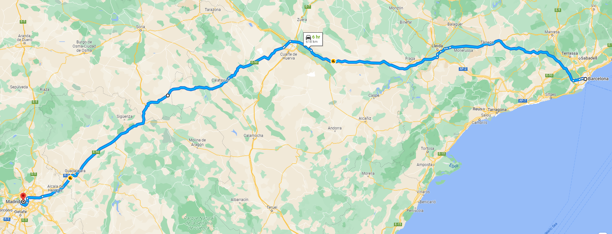
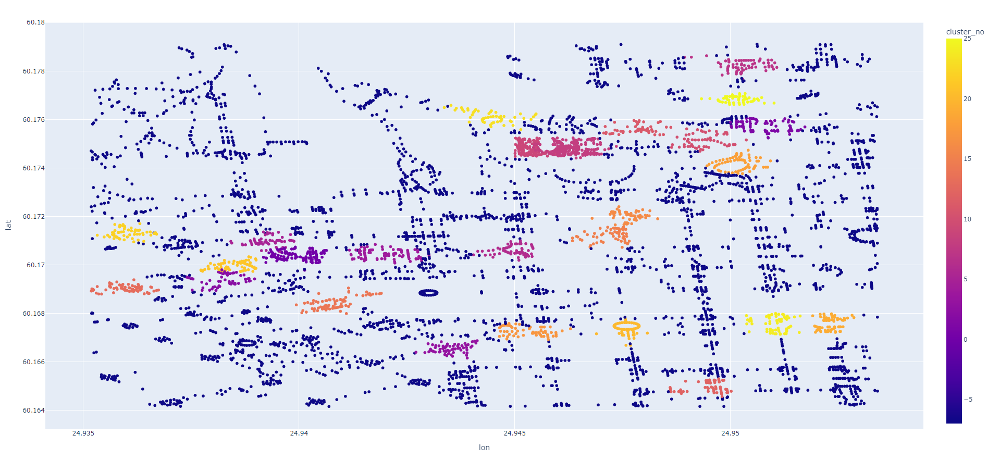

# Hierarchical Pathfinding

Hierarchical pathfinding is a technique that provides a way to navigate on different
levels of road network. This is accomplished using node clustering and precomputing
optimal paths within clusters. Hierarchical pathfinding significantly increases
pathfinding speed. For example, to find a route from Madrid To Barcelona, A* algorithm
would not discover every edge in-between, but focus on pathfinding among clusters 
(districts and/or cities).

## Performance

Dataset: Helsinki road network (5750 nodes, 13364 edges, 26 clusters).  
Clusters visualization can be found below.  
Computing distance matrix for n random nodes:

|  n  | Without clustering | With clustering |
|:---:|:------------------:|:---------------:|
| 25  |      7441 ms       |     6671 ms     |
| 50  |      8473 ms       |     6958 ms     |
| 100 |      28338 ms      |    20284 ms     |

## Documentation

~~~c++
#include "graph.h"
class Graph;
~~~
Class representing clusterized directed weighted graph.

~~~c++
#include "graph.h"
Graph from_graphml(const std::string&);
~~~
Create Graph object form GraphML file. < key > tag attributes required:
"x" (lon), "y" (lat), "length" (weight).

~~~c++
#include "graph.h"
void clusterize(double threshold);
~~~
Clusterize graph nodes and precompute optimal paths within clusters.
Threshold is set in kilometers. Iterative algorithm, merges clusters 20 times,
removing small clusters in the end. Haversine is used as a distance function.

~~~c++
#include "graph.h"
Path find_path_astar(uint64_t start, uint64_t goal, const Graph&,
                     bool use_clusters = true, double heuristic_multiplier = 100);
~~~
Find a path between start and goal nodes (by ID). Uses A* algorithm with binary heap
as a data structure. The higher heuristic_multiplier, the more heuristic-focused
search will be.

~~~c++
#include "path.h"
void to_gpx(uint64_t, const std::string&, const node_map*) const;
~~~
Export path to GPX file as a track. Start node of a path is required (by ID), since
it is not stored in an object. node_map can be obtained using Graph::get_nodes().

~~~c++
#include "graph.h"
size_t cluster_count() const;
~~~
Return number of precomputed clusters.

~~~c++
#include "graph.h"
void export_nodes(const std::string&) const;
~~~
Export node data to CSV file. It can be further visualized using plot_nodes.py script:
~~~
python plot_nodes.py nodes.csv clusters.html
~~~

The data can also be visualized (put on the map) using geopandas.GeoDataFrame.explore().

## Future development

* Multilevel clustering
* Polygonal clustering
* Edge-based clustering
* DOT, JSON, BOOST input formats
